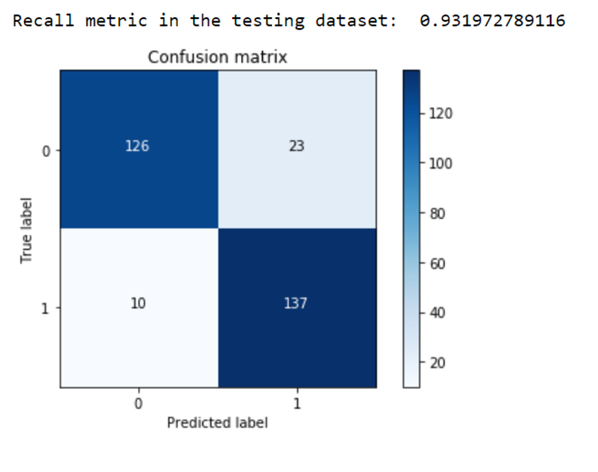

## **Credit card fraud detection**

Fraud losses incurred by banks and merchants on all credit, debit, and pre-paid general purpose and private label payment cards issued globally hit $21.84 billion (bn) in 2015, with the United States (US) accounting for almost two-fifths (38.7%) of the total at $8.45bn. But by 2020 it could surpass $12bn. So it is necessary to use ML and DL to find out fraud transactions and effectively track them.

This repo is the code and analysis done by joparga3 for the kaggle competition Credit card fraud detection. The dataset is imbalanced and it is really challenging to understand and analyse such dataset. I have choosen this dataset to learn how to train algorithm with extreme parameter tuning using K-fold validation. This code has given me good knowledge on coding. This repo is explanation how joparga3 has approached to problem and coded. 

### Packages needed:
    pandas-  data importing and cleaning and training algorithm
    matplotlib -  visualization
    numpy - data splitting and manipulation

This notebook will test different methods on skewed data. The idea is to
compare if preprocessing techniques work better when there is an
overwhelming majority class that can disrupt the efficiency of our
predictive model.

You will also be able to see how to apply cross validation for
hyperparameter tuning on different classification models. Intention is
to create models using:

1.  Logistic Regression

2.  SVMs

3.  Decision trees

Checking the target classes
===========================

{width="3.0370778652668418in"
height="2.032846675415573in"}

### Clearly the data is totally unbalanced!!

#### This is a clear example where using a typical accuracy score to evaluate our classification algorithm. For example, if we just used a majority class to assign values to all records, we will still be having a high accuracy, BUT WE WOULD BE CLASSIFYING ALL \"1\" INCORRECTLY!!

#### There are several ways to approach this classification problem taking into consideration this unbalance.

#### 

-   Collect more data? Nice strategy but not applicable in this case

-   Changing the performance metric:

    -   Use the confusion matrix to calculate Precision, Recall

    -   F1score (weighted average of precision recall)

    -   Use Kappa - which is a classification accuracy normalized by the
        > imbalance of the classes in the data

    -   ROC curves - calculates sensitivity/specificity ratio.

-   Resampling the dataset

    -   Essentially this is a method that will process the data to have
        > an approximate 50-50 ratio.

    -   One way to achieve this is by OVER-sampling, which is adding
        > copies of the under-represented class (better when you have
        > little data)

    -   Another is UNDER-sampling, which deletes instances from the
        > over-represented class (better when he have lot\'s of data)

Approach
========

1.  We are not going to perform feature engineering in first instance.
    > The dataset has been downgraded in order to contain 30 features
    > (28 anonamised + time + amount).

2.  We will then compare what happens when using resampling and when not
    > using it. We will test this approach using a simple logistic
    > regression classifier.

3.  We will evaluate the models by using some of the performance metrics
    > mentioned above.

4.  We will repeat the best resampling/not resampling method, by tuning
    > the parameters in the logistic regression classifier.

5.  We will finally perform classifications model using other
    > classification algorithms.

{width="3.4415441819772528in"
height="2.2887707786526685in"}

Setting our input and target variables + resampling.
====================================================

#### 1. Normalising the amount column. The amount column is not in line with the anonimised features.

#### 2. Assigning X and Y. No resampling.

#### 3. Resampling.

-   As we mentioned earlier, there are several ways to resample skewed
    > data. Apart from under and over sampling, there is a very popular
    > approach called SMOTE (Synthetic Minority Over-Sampling
    > Technique), which is a combination of oversampling and
    > undersampling, but the oversampling approach is not by replicating
    > minority class but constructing new minority class data instance
    > via an algorithm.

-   In this notebook, we will use traditional UNDER-sampling. I will
    > probably try to implement SMOTE in future versions of the code,
    > but for now I will use traditional undersamplig.

-   The way we will under sample the dataset will be by creating a 50/50
    > ratio. This will be done by randomly selecting \"x\" amount of
    > sample from the majority class, being \"x\" the total number of
    > records with the minority class.

**Logistic regression classifier - Undersampled data**

**We are very interested in the recall score, because that is the metric
that will help us try to capture the most fraudulent transactions. If
you think how Accuracy, Precision and Recall work for a confusion
matrix, recall would be the most interesting:**

-   Accuracy = (TP+TN)/total

-   Precision = TP/(TP+FP)

-   Recall = TP/(TP+FN)

**As we know, due to the imbalacing of the data, many observations could
be predicted as False Negatives, being, that we predict a normal
transaction, but it is in fact a fraudulent one. Recall captures this.**

-   Obviously, trying to increase recall, tends to come with a decrease
    > of precision. However, in our case, if we predict that a
    > transaction is fraudulent and turns out not to be, is not a
    > massive problem compared to the opposite.

-   We could even apply a cost function when having FN and FP with
    > different weights for each type of error, but let\'s leave that
    > aside for now.

### **Predictions on test set and plotting confusion matrix**

### 

### We have been talking about using the recall metric as our proxy of how effective our predictive model is. Even though recall is still the recall we want to calculate, just bear mind in mind that the undersampled data hasn\'t got a skewness towards a certain class, which doesn\'t make recall metric as critical.

{width="4.208333333333333in"
height="3.2618055555555556in"}

#### So, the model is offering an 93.2% recall accuracy on the generalised unseen data (test set). Not a bad percentage to be the first try. However, recall this is a 93.2% recall accuracy measure on the undersampled test set.

#### 

#### {width="3.177600612423447in" height="2.240641951006124in"} 

#### 

#### An additional comment that would be interesting to do is to initialise multiple undersampled datasets and repeat the process in loop. Remember that, to create an undersample data, we randomly got records from the majority class. Even though this is a valid technique, is doesn\'t represent the real population, so it would be interesting to repeat the process with different undersample configurations and check if the previous chosen parameters are still the most effective. In the end, the idea is to use a wider random representation of the whole dataset and rely on the averaged best parameters. 

#### 

References:

https://www.kaggle.com/mlg-ulb/creditcardfraud

https://www.kaggle.com/joparga3/in-depth-skewed-data-classif-93-recall-acc-now
